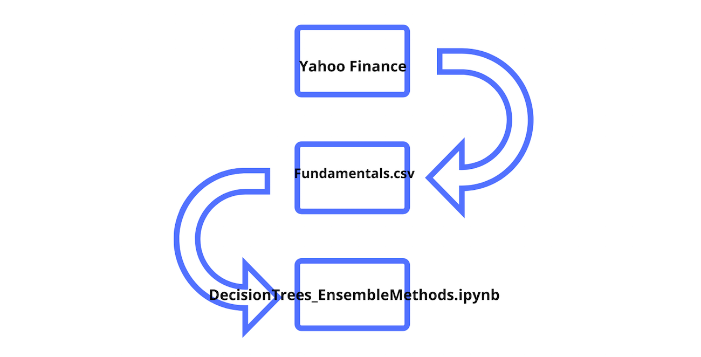

# Classification model which investigates through Decision Tree and Ensemble Methods which features influenced a positive net cash flow for companies listed with annual SEC 10K filings 

## Main Project Files

The data analysed were metrics extracted from annual SEC 10K fillings (2012-2016), enough to derive most of popular fundamental indicators.  Prices were fetched from Yahoo Finance, fundamentals are from Nasdaq Financials, extended by some fields from EDGAR SEC databases.

The target to predict was modelling which predictors influenced a positive net cash flow for each company listed.  This was investigated through Decision Tree and Ensemble Methods.

## Model Process Overview

Created by Sue Mir / Flatiron Data Science 
07/May/2020
